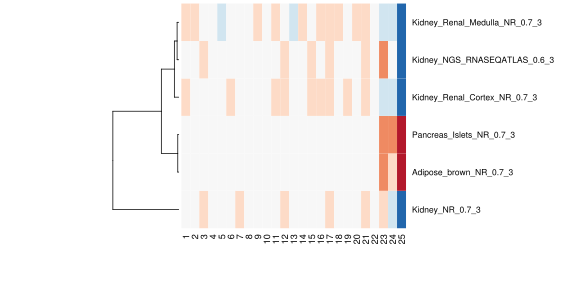
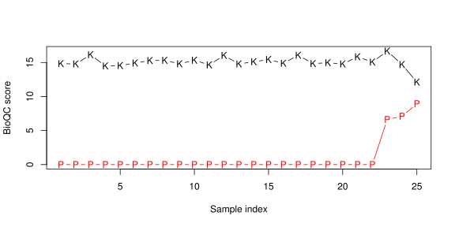

# BioQC-kidney: The kidney expression example

The BioQC-kindey example
========================
Supplementary Information for "Detect issue heterogenity in gene expression data with [*BioQC*](https://github.com/Accio/BioQC)" ([Jitao David Zhang](mailto:jitao_david.zhang@roche.com), Klas Hatje, Clemens Broger, Martin Ebeling and [Laura Badi](laura.badi@roche.com))


Introduction
------------
In this vignette, we demonstrate the use of *BioQC* with a case study where mouse kidney samples were profiled for gene expression. Results of BioQC pointed to potential tissue heterogeneity caused by pancreas contamination which was confirmed by qRT-PCR experiments. Source code and data needed to reproduce this document can be found in the github repository [BioQC-example](https://github.com/Accio/BioQC-example).

This is a supplementary documentation of *BioQC*, a R/Bioconductor package used to detect tissue heterogeneity from high-throughput gene expression profiling data with tissue-specific gene signatures. For its basic use please refer to the documentation and vignettes shipped along with the package, or to the other vignette [bioqc-simulation](bioqc-simulation.md) which applies the algorithm to simulated datsets. Here we demonstrate its use with a real biological data set, which is not included in the package distribution due to size limitations.


Importing the data
------------------
First, we load the package, the tissue-specific gene signatures, and the expression data into the R session. 


```r
library(BioQC)

gmtFile <- system.file("extdata/exp.tissuemark.affy.roche.symbols.gmt",
                        package="BioQC")
gmt <- readGmt(gmtFile)
```


```r
file <- "bioqc-nephrectomy.RData"
load(file)
print(eset)
```

```
## ExpressionSet (storageMode: lockedEnvironment)
## assayData: 34719 features, 25 samples 
##   element names: exprs 
## protocolData: none
## phenoData
##   sampleNames: FSP5.FVB.NJ.Sham.Placebo FS2.FVB.NJ.Sham.Control
##     ... FN6.FVB.NJ.Nephrectomy.Control (25 total)
##   varLabels: Experiment.name INDIVIDUALNAME ... Elastase (7 total)
##   varMetadata: labelDescription
## featureData
##   featureNames: 1415670_at 1415671_at ...
##     AFFX-TransRecMur/X57349_M_at (34719 total)
##   fvarLabels: GeneID GeneSymbol OrigGeneID OrigGeneSymbol
##   fvarMetadata: labelDescription
## experimentData: use 'experimentData(object)'
## Annotation:
```

The dataset contains expression of 34719 genes in 25 samples. The expression profile was normalized with RMA normalization. The signals were  also `log2`-transformed; however, this step does not affect the result of *BioQC* since it is essentially a non-parametric statistical test.


Running BioQC
-------------
Next we run the core function of the *BioQC* package, `wmwTest`, to perform the analysis.


```r
system.time(bioqcRes <- wmwTest(eset, gmt,
                                 valType="p.greater"))
```

```
##    user  system elapsed 
##   2.597   0.022   2.618
```

The function returns *one-sided* $p$-values of Wilcoxon-Mann-Whitney test. We next visualize this metric after transformation.


```r
bioqcResFil <- filterPmat(bioqcRes, 1E-8)
bioqcAbsLogRes <- absLog10p(bioqcResFil)
```

By closer examination we find that the expression of pancreas and adipose specific genes is significantly enriched in samples 23-25: 


```r
library(RColorBrewer)
heatmap(bioqcAbsLogRes, Colv=NA, Rowv=TRUE,
        cexRow=0.85,
        col=rev(brewer.pal(7, "RdBu")),
        labCol=1:ncol(bioqcAbsLogRes))
```


(BioQC scores (defined as $|\log_{10}(p)|$) of the samples visualized in heatmap. Red and blue indicate high and low scores respectively.)

Visual inspection reveals that there might be contaminations in samples 23-25, potentially by pancreas and adipose tissue. 

```r
filRes <- bioqcAbsLogRes[c("Kidney_NGS_RNASEQATLAS_0.6_3",
                           "Pancreas_Islets_NR_0.7_3"),]
matplot(t(filRes), pch=c("K", "P"), type="b", lty=1L,
        ylab="BioQC score", xlab="Sample index")
```

<div class="figure" style="text-align: center">

<p class="caption">test</p>
</div>
(BioQC scores (defined as $|\log_{10}(p)|$) of the samples. K and P represent kidney and pancreas signature scores respectively. )

Validation with quantitative RT-PCR
===================================
To confirm the hypothesis generated by *BioQC*, we performed qRT-PCR experiments to test two pancreas-specific genes' expression in the same  set of samples. Note that the two genes (amylase and elastase) are not included in the signature set provided by BioQC.


R Session Info
----------------

```r
sessionInfo()
```

```
## R version 3.1.3 (2015-03-09)
## Platform: x86_64-unknown-linux-gnu (64-bit)
## Running under: Red Hat Enterprise Linux Server release 6.3 (Santiago)
## 
## locale:
##  [1] LC_CTYPE=en_US.UTF-8       LC_NUMERIC=C              
##  [3] LC_TIME=en_US.UTF-8        LC_COLLATE=en_US.UTF-8    
##  [5] LC_MONETARY=en_US.UTF-8    LC_MESSAGES=en_US.UTF-8   
##  [7] LC_PAPER=en_US.UTF-8       LC_NAME=C                 
##  [9] LC_ADDRESS=C               LC_TELEPHONE=C            
## [11] LC_MEASUREMENT=en_US.UTF-8 LC_IDENTIFICATION=C       
## 
## attached base packages:
## [1] parallel  methods   stats     graphics  grDevices utils     datasets 
## [8] base     
## 
## other attached packages:
## [1] RColorBrewer_1.1-2  BioQC_1.02.1        Biobase_2.26.0     
## [4] BiocGenerics_0.12.1 Rcpp_0.12.0         knitr_1.13         
## 
## loaded via a namespace (and not attached):
##  [1] digest_0.6.9    evaluate_0.9    formatR_1.4     htmltools_0.3.5
##  [5] magrittr_1.5    rmarkdown_1.0   stringi_1.0-1   stringr_1.0.0  
##  [9] tools_3.1.3     yaml_2.1.13
```
