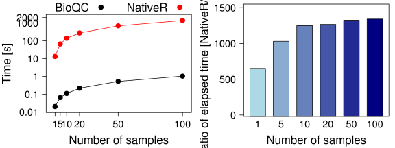

# BioQC-kidney: The kidney expression example
Supplementary Information for "Detect issue heterogenity in gene expression data with [*BioQC*](https://github.com/Accio/BioQC)" ([Jitao David Zhang](mailto:jitao_david.zhang@roche.com), Klas Hatje, Clemens Broger, Martin Ebeling and [Laura Badi](laura.badi@roche.com))


In this vignette, we perform simulations with both model-generated and real-world data using *BioQC*. We show that *BioQC* is a fast and sensitive method to detect tissue heterogeneity from high-throughput gene expression data. The source code to produce this document can be found in the github repository [BioQC-example](https://github.com/Accio/BioQC-example).

*BioQC* is a R/Bioconductor package to detect tissue heterogeneity from high-throughput gene expression profiling data. It implements an      efficient Wilcoxon-Mann-Whitney test, and offers tissue-specific gene signatures that are ready to use 'out of the box'.


Experiment setup
----------------
In this document, we perform three simulation studies with *BioQC*:

* **Time benchmark** tests the time-efficiency of the Wilcoxon test implemented in *BioQC*, compared with the native implementation in *R;
* **Sensitivity benchmark** tests the sensitivity and specificity of *BioQC* detecting tissue heterogeneity using model-generated simulated data;
* **Mixing benchmark** tests the sensitivity and specificity of *BioQC* using simulated contamination with real-world data.

All source code that is needed to reproduce the results can be found in the `.Rmd` file generating this document. 


```r
library(testthat)
library(BioQC)
library(hgu133plus2.db) ## to simulate an microarray expression dataset
library(lattice)
library(latticeExtra)
library(GEOquery)
library(xtable)
library(gplots)
library(rbenchmark)

pdf.options(family="ArialMT", useDingbats=FALSE)

set.seed(1887)

## list human genes
humanGenes <- unique(na.omit(unlist(as.list(hgu133plus2SYMBOL))))

## read tissue-specific gene signatures
gmtFile <- system.file("extdata/exp.tissuemark.affy.roche.symbols.gmt",
                       package="BioQC")
gmt <- readGmt(gmtFile)
```


Time benchmark
--------------
In the first experiment, we setup expression matrices of 20155 human protein-coding genes of 1, 5, 10, 50, or 100 samples. Genes  are $i.i.d$ distributed following $\mathcal{N}(0,1)$. The Wilcoxon-Mann-Whitney test implemented in *BioQC* and the native *R* implementation are applied to the matrices respectively.


The numeric results of both implementations, `bioqcNumRes` (from *BioQC*) and `rNumRes` (from *R*), are equivalent, as shown by the next     command.


```r
expect_equal(bioqcNumRes, rNumRes)
```

The *BioQC* implementation is more than 500 times much faster (fig...): while it takes about one second for BioQC to calculate enrichment scores of all 155 signatures in 100 samples, the native R implementation takes about 20 minutes.


<div class="figure" style="text-align: center">

<p class="caption">Time benchmark results of BioQC and R implementation of Wilcoxon-Mann-Whitney test. Left panel: elapsed time in seconds (logarithmic Y-axis). Right panel: ratio of elapsed time by two implementations. All results achieved by a single thread on in a RedHat Linux server.</p>
</div>


R Session Info
----------------

```r
sessionInfo()
```

```
## R version 3.1.3 (2015-03-09)
## Platform: x86_64-unknown-linux-gnu (64-bit)
## Running under: Red Hat Enterprise Linux Server release 6.3 (Santiago)
## 
## locale:
##  [1] LC_CTYPE=en_US.UTF-8       LC_NUMERIC=C              
##  [3] LC_TIME=en_US.UTF-8        LC_COLLATE=en_US.UTF-8    
##  [5] LC_MONETARY=en_US.UTF-8    LC_MESSAGES=en_US.UTF-8   
##  [7] LC_PAPER=en_US.UTF-8       LC_NAME=C                 
##  [9] LC_ADDRESS=C               LC_TELEPHONE=C            
## [11] LC_MEASUREMENT=en_US.UTF-8 LC_IDENTIFICATION=C       
## 
## attached base packages:
## [1] stats4    parallel  methods   stats     graphics  grDevices utils    
## [8] datasets  base     
## 
## other attached packages:
##  [1] rbenchmark_1.0.0     gplots_3.0.1         xtable_1.8-2        
##  [4] GEOquery_2.32.0      latticeExtra_0.6-28  RColorBrewer_1.1-2  
##  [7] lattice_0.20-33      hgu133plus2.db_3.0.0 org.Hs.eg.db_3.0.0  
## [10] RSQLite_1.0.0        DBI_0.4-1            AnnotationDbi_1.28.2
## [13] GenomeInfoDb_1.2.5   IRanges_2.0.1        S4Vectors_0.4.0     
## [16] BioQC_1.02.1         Biobase_2.26.0       BiocGenerics_0.12.1 
## [19] Rcpp_0.12.0          testthat_1.0.2       knitr_1.13          
## 
## loaded via a namespace (and not attached):
##  [1] bitops_1.0-6       caTools_1.17.1     crayon_1.3.1      
##  [4] digest_0.6.9       evaluate_0.9       formatR_1.4       
##  [7] gdata_2.17.0       grid_3.1.3         gtools_3.5.0      
## [10] htmltools_0.3.5    KernSmooth_2.23-15 magrittr_1.5      
## [13] memoise_1.0.0      R6_2.1.2           RCurl_1.95-4.8    
## [16] rmarkdown_1.0      stringi_1.0-1      stringr_1.0.0     
## [19] tools_3.1.3        XML_3.98-1.3       yaml_2.1.13
```
