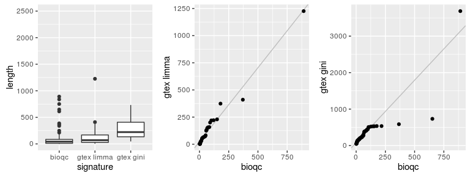
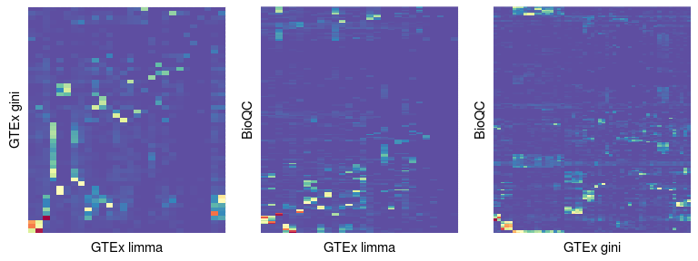
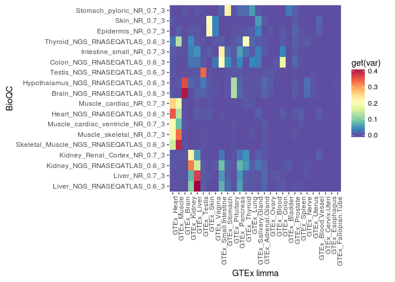

Here, we compare the overlap of the signatures derived from GTEx in an
earlier step with those from BioQC derived with Gini index.

### Define functions and load data {#define-functions-and-load-data}

~~~~ r
# functions for comparing sets. 
intersectSigs = function(gmt1, gmt2, sig1, sig2) {
  genes1 = gmt1[[sig1]]$genes
  genes2 = gmt2[[sig2]]$genes
  return(c(length(genes1), length(genes2), length(intersect(genes1, genes2))))
}

jaccInd = function(gmt1, gmt2, sig1, sig2) {
  is = intersectSigs(gmt1, gmt2, sig1, sig2)
  return(is[3]/(sum(is[1:2]) - is[3]))
}

drawVenn = function(gmt1, gmt2, sig1, sig2) {
  is = intersectSigs(gmt1, gmt2, sig1, sig2)
  plot.new()
  draw.pairwise.venn(is[1], is[2], is[3])
}

fisherTest = function(gmt1, gmt2, sig1, sig2) {
  is = intersectSigs(gmt1, gmt2, sig1, sig2)
  mat = matrix(c(is[3],is[2]-is[3],is[1]-is[3],sum(is[1:2])-is[3]), ncol=2)
  return(fisher.test(mat)$p.value)
}
~~~~

~~~~ r
# load signatures from BioQC
bioqc = readGmt(system.file("extdata/exp.tissuemark.affy.roche.symbols.gmt", package="BioQC"))
gtex = readGmt("gmt/gtex_signatures.gmt")
gtex.gini = readGmt("gmt/gtex_signatures_gini.gmt") 
~~~~

### Signature Length {#signature-length}

We compare the lengths of the signatures derived by the two methods.

~~~~ r
sigLength = function(gmt) {
  return(unlist(lapply(gmt, function(x) {return(length(x$genes))})))
}
gg_qq = function(data, x, y) {
  qqr = qqplot(data[data[,1]==x,2], data[data[,1]==y,2], plot.it=FALSE)
  data.2 = data.frame(x=qqr$x, y=qqr$y)
  colnames(data.2) = c(x, y)
  coef = coef(rlm(data.2[,2] ~ data.2[,1]))
  return(ggplot(data.2, aes(x=get(x), y=get(y))) +
              geom_abline(intercept=coef[1], slope=coef[2], color="grey") +
              geom_point() + 
              labs(x=x, y=y))
}

length.bioqc = sigLength(bioqc)
length.gtex = sigLength(gtex)
length.gtex.gini = sigLength(gtex.gini)
box.data = rbind(
  data.frame(signature=rep("bioqc", length(length.bioqc)), length=length.bioqc),
  data.frame(signature=rep("gtex limma", length(length.gtex)), length=length.gtex),
  data.frame(signature=rep("gtex gini", length(length.gtex.gini)), length=length.gtex.gini))

boxp = ggplot(box.data, aes(x=signature, y=length)) + geom_boxplot()
boxp = boxp + coord_cartesian(ylim = c(0, 2500))

grid.arrange(boxp, 
             gg_qq(box.data, "bioqc", "gtex limma"), 
             gg_qq(box.data, "bioqc", "gtex gini"), ncol=3)
~~~~

    ## Warning in rlm.default(x, y, weights, method = method, wt.method =
    ## wt.method, : 'rlm' failed to converge in 20 steps

**Left**: boxplot comparing the signature lengths of BioQC, and the
signature sets derived from GTEx with limma and gini-index respectively.
**Middle, Right**: quantile-quantile plots of the lenghts of the BioQC
signatures and the signatures sets derived from GTEx with limma and
gini-index respectively.

The signatures from GTEx appear to be substantially larger than the ones
shipped with BioQC. Particularliy those generated with gini-index.
Essentially, this boils down to a threshold problem. Adjusting the
log-fold-change cutoff or the minimal required gini-index in
`create_gtex_signatures.Rmd` has a direct impact on the signature sizes.
The quantile-quantile plots indicate, that signatures grow linearely
whith a less stringent threshold.

### Compare the signature sets using jaccard index {#compare-the-signature-sets-using-jaccard-index}

~~~~ r
pairwiseJaccMat = function(gmt1, gmt2, name1, name2) { 
  jacc.mat = matrix(nrow=length(gmt1),
                  ncol=length(gmt2),
                  dimnames=list(names(gmt1), names(gmt2)))

  for(i in 1:ncol(jacc.mat)) {
    for(j in 1:nrow(jacc.mat)) {
      jacc.mat[j,i] = jaccInd(gmt1, gmt2, names(gmt1)[j], names(gmt2)[i])
    }
  }

  jm = melt(jacc.mat)
  colnames(jm) = c(name1, name2, "jaccard_index")

  # cluster signatures
  ord1 = hclust(dist(jacc.mat))$ord
  ord2 = hclust(dist(t(jacc.mat)))$ord
  jm[,1] = factor(jm[,1], levels = rownames(jacc.mat)[ord1])
  jm[,2] = factor(jm[,2], levels = colnames(jacc.mat)[ord2])
  return(jm)
}

make.plot = function(jm, var="jaccard_index") {
  x = colnames(jm)[1]
  y = colnames(jm)[2]
  hm.palette <- colorRampPalette(rev(brewer.pal(11, 'Spectral')), space='Lab')  
  return(ggplot(jm, aes(x=get(x), y=get(y))) + 
    geom_tile(aes(fill=get(var)))+
    scale_fill_gradientn(colours = hm.palette(100)) +
    theme(axis.text.x = element_text(angle = 90, hjust = 1)) + 
    labs(x=x, y=y))
}

# pdf("fig/jaccard-index.pdf", width=25, height=10)
# print(make.plot())
# dev.off()
# 
# # make heatmap. 
# print(make.plot() + theme(axis.text=element_text(size=6)))

glgg_jm=pairwiseJaccMat(gtex, gtex.gini, "GTEx limma", "GTEx gini")
glgg = make.plot(glgg_jm)
glbqc_jm=pairwiseJaccMat(gtex, bioqc, "GTEx limma", "BioQC")
glbqc = make.plot(glbqc_jm)
gggbc_jm=pairwiseJaccMat(gtex.gini, bioqc, "GTEx gini", "BioQC")
gggbc = make.plot(gggbc_jm)

pdf("compare_signatures_files/jaccard_gtex-limma_gtex-gini.pdf", width=10, height=12)
print(glgg)
dev.off()

pdf("compare_signatures_files/jaccard_gtex-limma_bioqc.pdf", width=10, height=35)
print(glbqc)
dev.off()

pdf("compare_signatures_files/jaccard_gtex-gini_bioqc.pdf", width=15, height=35)
print(gggbc)
dev.off()

th = theme(axis.ticks.x=element_blank(),
           axis.ticks.y=element_blank(), 
           axis.text.x=element_blank(),
           axis.text.y=element_blank(), legend.position="none")

grid.arrange(glgg + th, glbqc + th, gggbc + th,ncol=3)
~~~~

Heatmaps showing the jaccard index between the different signatures.
Open the PDF files to see the figure with labels: [GTEx limma:GTEx
gini](compare_signatures_files/jaccard_gtex-limma_gtex-gini.pdf), [GTEx
limma:BioQC](compare_signatures_files/jaccard_gtex-limma_bioqc.pdf),
[GTEx gini:BioQC](compare_signatures_files/jaccard_gtex-gini_bioqc.pdf)

Here we filter the matrix for having at least one pair of signatures per
row having a jaccard index of

~~~~ r
bqc.sig = unique(data.table(glbqc_jm)[jaccard_index > jacc.thres,BioQC])
glpqc_jm.sig = glbqc_jm[glbqc_jm$BioQC %in% bqc.sig,]
make.plot(glpqc_jm.sig)
~~~~

R Session Info {#r-session-info}
--------------

~~~~ r
sessionInfo()
~~~~

    ## R version 3.3.1 (2016-06-21)
    ## Platform: x86_64-pc-linux-gnu (64-bit)
    ## Running under: CentOS Linux 7 (Core)
    ## 
    ## locale:
    ##  [1] LC_CTYPE=en_US.UTF-8       LC_NUMERIC=C              
    ##  [3] LC_TIME=en_US.UTF-8        LC_COLLATE=en_US.UTF-8    
    ##  [5] LC_MONETARY=en_US.UTF-8    LC_MESSAGES=en_US.UTF-8   
    ##  [7] LC_PAPER=en_US.UTF-8       LC_NAME=C                 
    ##  [9] LC_ADDRESS=C               LC_TELEPHONE=C            
    ## [11] LC_MEASUREMENT=en_US.UTF-8 LC_IDENTIFICATION=C       
    ## 
    ## attached base packages:
    ## [1] grid      parallel  methods   stats     graphics  grDevices utils    
    ## [8] datasets  base     
    ## 
    ## other attached packages:
    ##  [1] knitr_1.13          data.table_1.9.6    MASS_7.3-45        
    ##  [4] stringr_1.0.0       RColorBrewer_1.1-2  reshape2_1.4.1     
    ##  [7] ggplot2_2.1.0       VennDiagram_1.6.17  futile.logger_1.4.3
    ## [10] gridExtra_2.2.1     BioQC_1.02.1        Biobase_2.32.0     
    ## [13] BiocGenerics_0.18.0 Rcpp_0.12.5         ribiosUtils_1.1-1  
    ## 
    ## loaded via a namespace (and not attached):
    ##  [1] magrittr_1.5         munsell_0.4.3        colorspace_1.2-6    
    ##  [4] plyr_1.8.4           tools_3.3.1          gtable_0.2.0        
    ##  [7] lambda.r_1.1.9       htmltools_0.3.5      yaml_2.1.13         
    ## [10] digest_0.6.9         formatR_1.4          futile.options_1.0.0
    ## [13] evaluate_0.9         rmarkdown_1.0        labeling_0.3        
    ## [16] stringi_1.1.1        BiocInstaller_1.22.3 scales_0.4.0        
    ## [19] chron_2.3-47
